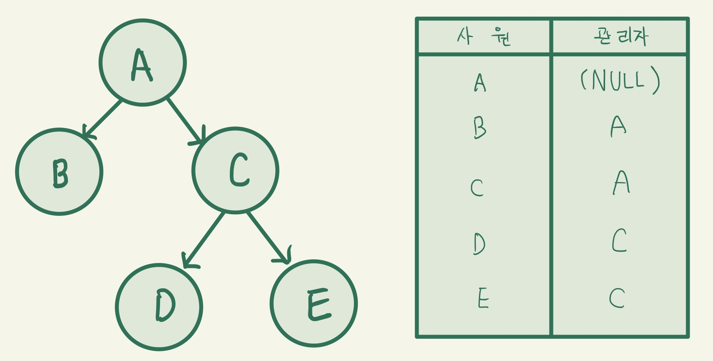

### SQL 활용
#### 표준 조인
- 일반집합연산자
  - UNION : 합집합을 제공하는 연산자
    ```sql
    -- UNION 연산
    SELECT 열 이름1
    FROM 테이블명1
    UNION
    SELECT 열 이름2
    FROM 테이블명2;
    -- UNION ALL 연산
    SELECT 열 이름1
    FROM 테이블명1
    UNION ALL
    SELECT 열 이름2
    FROM 테이블명2;
    ```
    - 교집합의 중복을 제거하는 연산을 수행해 정렬작업으로 인한 시스템에 부하가 발생할 수 있음
    - UNION ALL은 중복을 포함해 보여줌(정렬작업 X)
  - INTERSECTION : 교집합을 제공하는 연산자
    ```sql
    -- INTERSECT 연산
    SELECT 열 이름1
    FROM 테이블명1
    WHERE 조건절1
    INTERSECT
    SELECT 열 이름2
    FROM 테이블명2
    WHERE 조건절2;
    ```
  - DIFFERENCE(EXCEPT, MINUS)
    ```sql
    -- MINUS 연산
    SELECT 열 이름1
    FROM 테이블명1
    WHERE 조건절1
    MINUS
    SELECT 열 이름2
    FROM 테이블명2
    WHERE 조건절2;
    ```
    - 차집합을 제공하는 연산자로 첫 번째 집합에서 두 번째 집합의 공통 집합을 제외
    - 오라클에서는 MINUS로 SQL문 수행
  - PRODUCT(CROSS JOIN)
    - 곱집합을 제공하며, JOIN 조건이 없는 경우 생길 수 있는 모든 데이터 조합 연산자
    - 양쪽 집합의 M*N의 데이터 조합이 발생하며, CARTESIAN PRODUCT라고도 함
- 순수관계연산자
  - SELECT
    - 행들에 대한 부분집합으로, WHERE절 기능으로 구현
  - PROJECT
    - 열들에 대한 부분집합으로, SELECT절의 열 선택으로 구현
  - NATURAL JOIN
    - WHERE절에 조인 조건을 기재해 구현
    - NATURAL JOIN, INNER JOIN, LEFT OUTER JOIN, RIGHT OUTER JOIN, USING 조건절, ON 조건절 등이 있음
  - DIVIDE 연산
    - 나눗셈과 비슷한 개념의 연산자로, SQL문으로는 없음
- 조인 형태
  - INNER JOIN : JOIN 조건에서 동일한 값이 있는 행만 반환
    ```sql
    -- INNER JOIN
    SELECT 열 이름
    FROM 테이블명1, 테이블명2
    WHERE 테이블명1 = 테이블명2;
    ```
  - NATURAL JOIN : 두 테이블 간 동일한 이름을 갖는 열들에 대해 INNER JOIN 수행
    ```sql
    -- NATURAL JOIN 실습
    SELECT 열 이름1,
        열 이름2
    FROM 테이블명1,
        테이블명2
    WHERE 테이블명1;
    NATURAL JOIN 테이블명2;
    -- NATURAL JOIN을 INNER JOIN으로 변환
    SELECT 열 이름1,
        열 이름2
    FROM 테이블명1,
        테이블명2
    WHERE 테이블명1 = 테이블명2;
    ```
  - USING 조건절 : 같은 이름을 가진 열들 중 원하는 열에 대한 선택적 INNER JOIN 수행
    ```sql
    -- USING절 실습
    SELECT 열 이름1,
            열 이름2
    FROM 테이블명1,
        JOIN 테이블명2 USING (열 이름);
    ```
  - ON 조건절 : JOIN 서술부와 비 JOIN 서술부를 분리해 이해가 쉽고 열 이름이 달라도 JOIN 조건을 사용할 수 있음
    ```sql
    -- ON절 실습
    SELECT 열 이름1,
        열 이름2
    FROM 테이블명1
        INNER JOIN 테이블명2 ON (조인 열 이름1 = 조인 열 이름2);
    ```
  - CROSS JOIN : 일반집합연산자의 PRODUCT 개념으로, 테이블 간 JOIN 조건이 없는 경우 생길 수 있는 모든 데이터의 조합
    ```sql
    -- CROSS JOIN - 조인 조건 없는 방식
    SELECT 열 이름1, 열 이름2
    FROM 테이블명1, 테이블명2;
    -- CROSS JOIN - ANSI 표준 방식
    SELECT 열 이름1, 열 이름2
    FROM 테이블명1
        CROSS JOIN 테이블명2;
    ```
  - OUTER JOIN : JOIN 조건에서 동일한 값이 없는 행도 결과 집합에 포함 시킬 때 사용
    ```sql
    -- LEFT OUTER JOIN - 오라클 DBMS 방식
    SELECT 열 이름1, 열 이름2
    FROM 테이블명1, 테이블명2
    WHERE 조인 열 이름1 = 조인 열 이름2(+);
    -- LEFT OUTER JOIN - ANSI 방식
    SELECT 열 이름1, 열 이름2
    FROM 테이블명1 LEFT OUTER JOIN 테이블명2 ON(조인 열 이름1 = 조인 열 이름2);
        -- LEFT OUTER JOIN - 오라클 DBMS 방식
    SELECT 열 이름1, 열 이름2
    FROM 테이블명1, 테이블명2
    WHERE 열 이름1(+) = 열 이름2;
    -- LEFT OUTER JOIN - ANSI 방식
    SELECT 열 이름1, 열 이름2
    FROM 테이블명1 RIGHT OUTER JOIN 테이블명2 ON(조인 열 이름1 = 조인 열 이름2);
    -- FULL OUTER JOIN - ANSI 방식
    SELECT 열 이름1, 열 이름2
    FROM 테이블명1 FULL OUTER JOIN 테이블명2 ON(조인 열 이름1 = 조인 열 이름2);
    ```

#### 계층형 질의와 셀프 조인
- 계층형 질의

  - 테이블 내 계층형 데이터가 존재하는 경우 데이터를 조회하기 위해 계층형 질의를 사용함
  - 계층형 데이터란 동일 테이블에 계층적으로 상위와 하위 데이터가 포함된 데이터를 말함
- 오라클 계층형 SQL
  - 오라클 DBMS에서 제공하는 기존 SELECT문에 START WITH, CONNECT BY, ORDER SIBLINGS BY문을 결합한 구조
  - 계층형 SQL문은 위의 6가지 결합된 형태로 이루어져 있으며, 계층형 SQL문에서는 오라클 내부에서 제공하는 Pseudo 가상 열이 있음
  - START WITH 조건 : 계층 구조 전개의 시작 위치를 지정하는 구문으로, 루트 데이터를 지정함
  - CONNECT BY [NOCYCLE] [PRIOR] A AND B
    - CONNECT BY절 : 다음에 전개될 자식 데이터를 지정하는 구문
    - PRIOR PK(자식) = FK(부모) 형태를 사용하면 계층 구조에서 자식 데이터에서 부모 데이터(부모 -> 자식) 방향으로 전개하는 순방향 전개를 함
    - PRIOR FK(부모) = PK(자식) 형태를 사용하면 반대로 자식 데이터에서 부모 데이터(자식 -> 부모)로 전개하는 역방향 전개를 함
    - NOCYCLE을 추가하면 사이클이 발생한 이후 데이터는 전개하지 않음
  - ORDER SIBLINGS BY 열 이름 : 형제 노드(동일 레벨) 사이에서 정렬을 수행
- 계층형 SQL문
  ```sql
  SELECT 열 이름1,
        CONNECT_BY_ISLEAF AS CBI
        SYS_CONNECT_BY_PATH(계층형의 경로)
  FROM 테이블명1, 테이블명2
  WHERE 조인 열 이름1 = 조인 열 이름2
  START WITH 열 이름 IS 시작행
  CONNECT BY PRIOR 자식 열 이름(PK) = 부모 열 이름(FK)
  ORDER SIBLINGS BY 열 이름;
  ```
- SELF JOIN을 활용한 계층형
  ```sql
  SELECT 열 이름
  FROM 테이블명1, 테이블명1
  WHERE 조인 열 이름1 = 조인 열 이름2;
  ```

#### 서브쿼리
- 하나의 SQL문 안에 포함되어 있는 또 다른 SQL문
- 메인쿼리의 열을 사용할 수 있으며, 반대로 메인 쿼리는 서브쿼리의 열을 사용할 수 없음
- 서브쿼리는 메인쿼리가 가지고 있는 열을 이욜할 수 있지만 자신의 열을 메인쿼리에 줄 수 없음
- 서브쿼리 사용 시 주의점
  - 서브쿼리를 소괄호()로 감싸서 사용
  - 단일행 또는 복수행 비교 연산자와 함께 사용 가능
  - 단일행 비교 연산자는 서브쿼리 결과가 반드시 1건 이하여야 함
  - 복수행 비교 연산자는 서브쿼리 결과 건수와 상관없음
  - 서브쿼리 내에서는 ORDER BY절을 사용하지 못하며, ORDER BY절은 전체 SQL문 내에서 오직 1개만 올 수 있기 때문에 ORDER BY절은 메인쿼리의 맨 마지막 SQL문 아래에 위치해야 함
- 서브쿼리 사용이 가능한 위치
  - SELECT절, FROM절, WHERE절, HAVING절, INSERT문의 VALUES절, UPDATE문의 SET절
- 서브쿼리 동작 방식
  - 비연관 서브쿼리 : 메인쿼리의 열을 가지고 있지 않은 형태의 서브쿼리로 메인쿼리에 값을 제공하기 위한 목적으로 주로 사용함
  - 연관 서브쿼리 : 메인쿼리의 값을 가지고 있는 형태의 서브 쿼리, 일반적으로 메인쿼리가 먼저 수행되어 읽혀진 데이터를 서브쿼리에서 조건이 맞는지 확인하고자 할 때 주로 사용
- 반환 형태에 따른 서브쿼리 분류
  - 단일행 서브쿼리 : 서브쿼리의 실행 결과가 항상 1건 이하인 서브쿼리를 의미, 항상 비교 연산자와 함께 사용하며 단일행 비교 연산자(=, <, <=, >, >=, <>)와 함께 사용
  - 다중행 서브쿼리 : 서브쿼리의 실행 결과가 여러 건인 서브쿼리를 의미, 다중행 비교 연산자와 함께 사용하며 다중행 비교 연산자(IN, ALL, ANY, SOME, EXIST)와 함께 사용
  - 다중행 서브쿼리 : 서브쿼리의 실행 결과가 여러 열을 반환하는 서브쿼리를 의미, 메인쿼리의 조건 절에 여러 칼럼을 동시에 비교할 수 있으며, 서브쿼리아 메인쿼리의 칼럼 수와 칼럼 순서와 동일해야함

#### 뷰
- SELECT SQL문으로 생성해 해당 뷰를 호출하면 내부에 있는 SQL문을 호출하는 역할을 함
  ```sql
  -- 뷰 생성
  CREATE OR REPLACE VIEW 뷰 이름
  AS
  SELECT절;
  -- 뷰 제거
  DROP VIEW 뷰 이름;
  ```
- 뷰 사용 시 장점
  - 독립성 : 테이블 구조가 변경되어도 뷰를 사용하는 응용 프로그램은 변경하지 않아도 됨
  - 편리성 : 복잡한 질의를 뷰로 생성함으로써 관련 질의를 단순하게 작성할 수 있음
  - 보안성 : 개인정보와 같은 숨기고 싶은 민감한 정보가 존재하면, 뷰를 생성할 때 해당 정보를 제외시키고 생성함으로써 사용자들에게 정보 노출을 하지 않을 수 있음