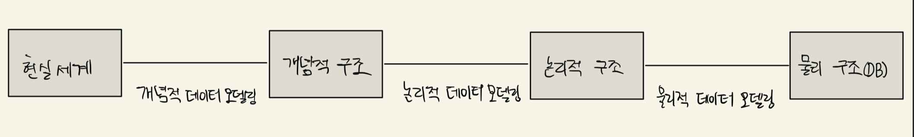
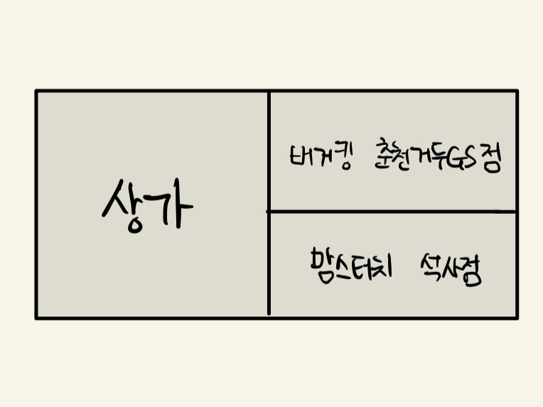

### 데이터 모델링의 이해
##### 모델링
- 우리가 살고 있는 3차원의 현실세계를 단순화, 추상화하는 것
- 복잡한 현실 세계를 추상화, 단순화, 명확화하기 위해 일정한 표기법으로 모델을 표현하는 기법
- 모델링의 특징
  - 추상화 : 복잡한 현실 세계를 일정한 형식에 맞게 표현
  - 단순화 : 복합한 현실 세계를 서로가 약속한 규악을 준수하는 표기법이나 언어로 표현
  - 명확화 : 복잡한 현실 세계를 명확하게 기술, 모델을 보는 여러 관계자가 이해하기 쉽게 표현
- 모델링의 3가지 관점
  - 데이터 관점(Data, What) : 비즈니스와 관련된 데이터는 무엇인지 또는 데이터 간의 관계는 무엇인지, What에 대한 관점을 의미
  - 프로세스 관점(Process, How) : 해당 비즈니스로 인해 일어나는 일은 어떠한 일인지, How에 대한 관점
  - 상관 관점(Data vs Process) : 데이터 관점과 프로세스 관점 간 서로 어떠한 영향을 받는지에 대한 관점

##### 데이터 모델링
- 현실 세계의 비즈니스를 IT 시스템으로 구현하기 위해 데이터 관점으로 업무를 분석하고 약속된 표기법으로 표현해 설계하는 과정
- 데이터 모델의 기능
  - 가시화 : 시스템의 모습을 가시화
  - 명세화 : 시스템의 구조와 발생하는 동작을 명세화
  - 구조화된 틀 제공 : 시스템을 구현하기 위해 필요한 구조화된 틀 제공
  - 문서화 : 시스템 구축 시 산출물로 사용되는 문서 제공
  - 다양한 관점 제공 : 다른 영역의 세부사항을 숨김으로써 다양한 영역에 집중할 수 있는 관점을 제공
  - 상세 수준의 표현 방법 제공 : 원하는 목표에 따라 구체화된 상세 수준의 표현 방법을 제공
- 데이터 모델의 중요성
  - 파급효과(Leverage) : 데이터 설계 과정에서 비효율적인 데이터 설계 업무 요건을 충족하지 못하는 데이터 설계 시 개발/테스트/오픈/운영의 전 과정에 걸쳐 큰 비용이 발생할 수 있음
  - 복잡한 정보 요구사항의 간결한 표현(Conciseness) : 좋은 데이터 모델 설계를 통해 IT 시스템에서 구현해야 할 정보 요구사항을 명확하고 간결하게 표현할 수 있음
  - 데이터 품질(Data Quality) : 데이터 모델의 잘못된 설계로 인한 데이터 중복, 비유연성, 비일관성이 발생으로 인해 데이터 품질이 저하되는 것을 방지
- 데이터 모델링 진행 단계

  - 1단계 - 개념적 데이터 모델링(추상적) : 시스템에서 구현하고자 하는 대상에 대한 포괄적 수준의 데이터 모델링, 전사적 데이터 모델링 시 많이 사용하는 단계
  - 2단계 - 논리적 데이터 모델링 : 시스템에서 구현하고자 하는 비즈니스를 만족하기 위한 기본키, 속성, 관계, 외래키 등을 정확하게 표현하는 단계
  - 3단계 - 물리적 데이터 모델링 : 논리 데이터 모델을 기반으로 실제 물리 DB 구축을 위해 성능, 저장공간 등의 물리적인 특성을 고려해 설계
- 프로젝트 생명 주기에서 데이터 모델링 단계
  - 정보전략계획 : 개념적 데이터 모델링
  - 분석 : 개념적 데이터 모델링, 논리적 데이터 모델링
  - 설계 : 물리적 데이터 모델링
  - 개발, 테스트, 전환/이행
- 데이터 독립성의 필요성 : 하위 단계 데이터 구조가 변경되어도 상위 단계에는 영향을 미치지 않음, 보유한 데이터 복잡도를 낮추고 중복된 데이터를 줄여 시간의 흐름에 따라 증가하는 시스템 유지보수 비용을 절감할 수 있음
- 데이터베이스 3단계 구조(ANSI/SPARC 3단계 구성의 데이터독립성 모델)
  - 외부 스키마(External Schema)
    - 각각의 사용자가 보는 DB 스키마
    - 개인 사용자 또는 응용 프로그램 개발자가 접근하는 사용자 관점 스키마
  - 개념 스키마(Conceptual Schema)
    - 모든 사용자의 관점을 하나로 통합한 비즈니스 전체의 DB를 기술한 스키마
    - 실제 DB에 저장되는 데이터와 응용 프로그램 및 사용자들 간의 관계를 표현
    - 응용 프로그램 및 사용자들이 필요한 데이터를 통합한 통합 관점의 스키마
  - 내부 스키마(Internal Schema)
    - DB가 물리적으로 저장된 형식을 표현한 스키마
    - 물리적 하드웨어 장치에 데이터가 실제로 저장되는 방법을 표현한 물리적 관점 스키마
  - 2가지 데이터 독립성 : 각 단계와 단계 사이를 연결하는 사상(매핑)이 있기 떄문
    - 논리적 데이터 독립성 : 개념 스키마가 변경되어도 외부 스키마에 영향을 미치지 않도록 지원, 논리적 구조가 변경되어도 응용 프로그램에 영향을 미치지 않음
      - 외부적/개념적 사상(논리적 사상) : 외부적 뷰와 개념적 뷰의 상호 호환성
    - 물리적 데이터 독립성 : 내부 스키마가 변경되어도 외부/개념 스키마는 영향을 받지 않도록 지원하는 것, 저장 장치의 구조 변경은 응용 프로그램/개념 스키마에 영향을 미치지 않음
      - 개념적/내부적 사상(논리적 사상) : 개념적 뷰와 저장된 데이터베이스의 상호 관련성
- 데이터 모델링의 3가지 요소
  - Thing : 업무가 관여하는 어떤 것
  - Attributes : 어떤 것이 가지는 성격
  - Relationships : 업무가 관여하는 어떤 것 간의 관계
- 데이터 모델링 용어
  - Thing 
    - 엔터티(Entity) ∈ 엔터티 타입(Entity Type)
    - 인스턴스(Instance), 어커런스(Occurrence) ∈ 엔터티(Entity)
  - Association between Things
    - 페어링(Pairing) ∈ 관계(Relationship)
  - Characteristic of a Thing
    - 속성값(Attribute Value) ∈ 속성(Attribute)
- ERD 작업 순서
  1. 비즈니스에 필요한 엔터티를 그
  2. 1번에서 그린 엔터티를 적절하게 배치
  3. 각 에넡티 간의 관계를 설정
  4. 설정한 관계의 관계명을 기술
  5. 설정한 관계의 참여도를 기술
  6. 설정한 관계의 필수 여부를 기술
- 데이터 모델링의 이해관계자 : 시스템을 구축하는 모든 사람은 데이터 모델링 작업을 전문적으로 할 수 있거나 완성된 모델을 정확하게 해석할 수 있어야함
- 좋은 데이터 모델의 요소
  - 완전성 : 업무에 필요한 데이터가 모두 정의되어있음
  - 중복 배제 : 동일한 사실은 단 한번만 저장해야함
  - 업무 규칙 : 데이터 모델 분석만으로 비즈니스 로직이 이해되어야 함
  - 데이터 재사용 : 데이터 통합성과 독립성을 고려해 재사용이 가능함
  - 의사소통 : 데이터 모델을 보고 이해 당사자들끼리 의사소통이 이루어질 수 있어야 함
  - 통합성 : 동일한 데이터는 유일하게 정의해 다른 영역에서 참고해야함

##### 엔터티
- 비즈니스 관점에서 시스템을 통해 저장 및 관리해야 하는 집합적인 어떤 것
- 사람, 사물, 사건, 개념 등의 명시에 해당
- 비즈니스 관점에서 IT 시스템을 통해 관리가 필요한 관심사에 해당
- 비즈니스를 구현하기 위해 저장해야 하는 어떤 것
- 엔터티와 인스턴스 : 엔터티는 인스턴스의 집합으로 1:M 관계를 가짐

- 엔터티 표기법 : 둥근 사각형을 그린 후 맨 위에 엔터티명을 기재
- 엔터티의 특징
  - 업무에서 필요로 하는 정보 : 비즈니스 요구 조건 만족을 위해 반드시 필요하고, 저장 및 관리하고자 하는 정보
  - 식별 가능 : 유일한 식별자에 의해 식별이 가능
  - 인스턴스의 집합 : 영속적으로 존재하는 2개 이상의 인스턴스 집합
  - 업무 프로세스에 의해 이용 : 비즈니스 프로세스에 의해 반드시 이용되어야함
  - 속성을 포함 : 반드시 속성을 가지고 있음
  - 관계의 존재 : 다른 엔터티와 최소 1개 이상의 관계가 있어야함
- 엔터티의 분류
  - 유무형에 따른 분류
    - 유형 : 실체가 존재하고 물리적인 형태가 있으며, 안정적이고 지속적으로 활용되는 엔터티
    - 개념 : 물리적인 형태가 존재하는 것은 아니지만 비즈니스적으로 관리해야 할 개념적 정보를 저장하는 엔터티
    - 사건 : 비즈니스를 수행함으로써 발생되는 엔터티로 유행/개념 엔터티에 비해 데이터 발생량이 많으며, 다양한 통계 자료에 이용될 수 있음
  - 발생시점에 따른 분류
    - 기본 : 비즈니스에서 스스로 태어난 독립적으로 생성된 정보로 타 엔터티의 부모 역할
    - 중심 : 기본 엔터티로부터 발생되며 비즈니스에 있어서 중심적인 역할을 하는 엔터티
    - 행위 : 2개 이상의 부모 엔터티로부터 발생되는 엔터티
- 엔터티 명명 규칙
  - 업무 담당자들이 사용하는 용어
  - 가능하면 약어를 사용하지 않음
  - 단수명사여야함
  - 해당 모델 내에서 유일한 이름이여야함
  - 생성 의미에 맞게 이름을 부여

##### 속성
- 비즈니스에서 필요함
- 엔터티에 대한 설명으로 인스턴스의 구성요소
- 의미상 더 이상 분리되지 않는 데이터 단위
- 엔터티, 인스턴스, 속성, 속성값의 관계
  - 1개의 엔터티는 2개 이상의 인스턴스 집합이어야 한다.
  - 1개의 엔터티는 2개 이상이 속성을 가짐
  - 1개의 속성은 1개의 속성값을 가짐
- 속성 표기법
  - 엔터티 내 속성 이름으로 표현
- 속성의 특징
  - 비즈니스에서 필요하며, 시스템에서 저장 및 관리하고자 하는 정보여야함
  - 정규화 이론에 따라 속성이 속해 있는 엔터티의 주식별자에 함수적 종속성을 가짐
  - 하나의 속성에는 1개의 값만을 가지며, 하나의 속성에 여러 개의 값이 있는 다중 값일 경우 별도의 데이터를 이용해 분리
- 속성의 분류
  - 특성에 따른 분류
    - 기본 속성(Basic Attribute) : 비즈니스 분석을 통해 도출된 속성
    - 설계 속성(Designed Attribute) : 비즈니스 분석을 통해 도출된 것은 아니지만 데이터 모델 설계를 하면서 도출하는 속성
    - 파생 속성(Derived Attribute) : 다른 속성에 의해 계산이나 변형이 되어 생성되는 속성
  - 엔터티 구성 방식에 따른 분류
    - PK(Primary Key) 속성 : 엔터티에서 단 하나의 인스턴스를 식별할 수 있는 속성
    - FK(Foreign Key) 속성 : 타 엔터티와의 관계를 통해 포함된 속성
    - 일반 속성 : 엔터티 내에 존재하면서 PK 혹은 FK 속성이 아닌 속성
- 도메인
  - 속성이 가질 수 있는 값의 범위
  - 각 속성의 속성값은 정의된 도메인 이외의 값을 가질 수 없음
- 속성이 명명 규칙
  - 비즈니스에 사용하는 이름으로 부여
  - 서술식으로 명명하지 않음
  - 약어 사용은 가급적 하지 않음
  - 전체 데이터 모델 내 유일한 이름의 속성명으로 명명

##### 관계
- 엔터티끼리 상호 연관성이 있는 상태
- 데이터 모델 내 존재하는 엔터티 간 논리적인 연관성
- 관게의 페어링 : 엔터티 내 인스턴스가 개별적으로 관계를 가지는 것을 의미
- 관계의 표기 : 1:1, 1:M, N:M 표현 방법이 있음
- 관계 선택사항 : 필수적 관계(실선), 선택적 관계(점선)
- 관계정의 시 체크 사항
  - 2개의 엔터티 사이에 관심 있는 연관 규칙은 존재하는가?
  - 2개의 엔터티 사이에 정보의 조합이 발생되는가?
  - 업무기술서, 장표에 관계연결에 대하나 규칙이 서술되어 있는가?
  - 업무기술서, 장표에 관계연결을 가능하게 하는 동사가 있는가?
- 관계읽기
  - 각각의 혹은 하나의 / 기준 엔터티 / 관계 차수 / 대상 엔터티 / 필수or선택 / 관계명
  - ex : 각각의 고객은 여러 개의 주문을 때때로 주문한다

##### 식별자
- 엔터티 내 하나의 인스턴스를 구별할 수 있는 논리적인 이름 또는 구분자
- 식별자 특징
  - 유일성 : 엔터티 내 존재하는 각각의 인스턴스 집합은 주식별자에 의해 유일하게 구분할 수 있음
  - 최소성 : 유일성을 만족하면 주식별자를 구성하는 속성 수는 최소한의 수로 이루어져야함
  - 불변성 : 엔터티 내 특정 인스턴스에 주식별자가 한번 정해지면 그 값은 변하지 말아야함
  - 존재성 : 주식별자가 지정되면 반드시 데이터 값이 존재해야함. 즉, NULL을 허용하지 않음
- 식별자 분류
  - 대표성 여부
    - 주식별자 : 엔터티 내 각가의 행을 구분할 수 있는 구분자로 다른 엔터티와 참조관계를 가질 때 연결할 수 있는 식별자
    - 보조식별자 : 엔터티 내에서 각각의 행을 구분할 수 있으며, 대표성을 가지지 못하기 때문에 다른 엔터티와 참조관계를 가질 때 연결할 수 없음
  - 스스로 생성 여부
    - 내부식별자 : 엔터티 내부에서 스스로 만들어지는 식별자
    - 외부식별자 : 다른 엔터티와의 관계를 통해 다른 엔터티로부터 받아오는 식별자
  - 속성의 수
    - 단일식별자 : 하나의 속성으로 구성된 식별자
    - 복합식별자 : 둘 이상의 속성으로 구성된 식별자
  - 대체 여부
    - 본질식별자 : 비즈니스에 의해 만들어지는 식별자
    - 인조식별자 : 비즈니스적으로 만들어지지는 않지만, 본질식별자가 복잡한 구성을 가지고 있기 때문에 인위적으로 만든 식별자
- 식별자 도출 기준
  - 비즈니스에서 자주 이용되는 속성을 주식별자로 지정
  - 명칭, 장소와 같이 이름으로 기술되는 속성은 가능하면 주식별자로 하지 않음
  - 주식별자를 복합식별자로 할 경우 지나치게 많은 속성이 포함되지 않도록함
- 비식별자 관계(Non-Identifying Relationship) : 자식 엔터티 입장에서 외부식별자(FK)를 자신의 식별자로 사용하고 있지 않은 것
  - 자식 엔터티에서 받은 속성이 반드시 필수가 아니어도 무방하기 때문에 부모 없는 자식이 생성될 수 있는 경우
  - 부모 엔터티의 주식별자를 자식 엔터티의 주식별자 속성으로 사용해도 되지만, 자식 엔터티에서 별도의 주식별자를 생성하는 것이 더 유리하다고 판단될 때, 비식별자 관계에 의한 외부식별자로 표현
- 식별자 관계
  - 목적 : 강한 연결 관계를 표현
  - 자식 주식별자 영향 : 부모 엔터티의 주식별자 속성이 자식 엔터티의 주식별자의 구성에 포함
  - 연결 고려사항 : 부모 엔터티에 종속되는 경우에 사용, 자식 엔터티의 주식별자 구성에 부모 엔터티의 주식별자 속성이 필요한 경우 사용, 부모 엔터티에게 상속받은 주식별자 속성을 타 엔터티에 이전이 필요한 경우 사용
- 비식별자 관계
  - 목적 : 약한 연결 관계를 표현
  - 자식 주식별자 영향 : 부모 엔터티의 주식별자 속성이 자식 엔터티의 일반 속성이 됨
  - 연결 고려사항 : 부모/자식 간 약한 종속 관계인 경우 사용, 자식 엔터티의 주식별자 구성을 독립적으로 구성할 경우 사용, 부모로부터 상속받은 주식별자 속성을 타 엔터티에 이전하지 않도록 차단이 필요한 경우 사용, 부모 엔터티의 주식별자가 NULL(선택 관계)이 허용되는 경우 사용